# Diagrama de Transiciones

## Máquina de Turing - Máquina de Turing - Fibonacci (Cinta Única)

Calcula F(n) usando una sola cinta. Símbolos: 1=unario, #=inicio, .=zona trabajo, ;=separador términos, x=contador usado, y/z=marcadores temporales

> **Generado automáticamente:** 2026-02-27 12:46:13

## Estadísticas

| Métrica | Valor |
|---------|-------|
| Estados | 24 |
| Transiciones | 58 |
| Estado inicial | `q0` |
| Estados de aceptación | `qaccept` |
| Alfabeto de cinta | `1`, `_`, `#`, `.`, `;`, `x`, `y`, `z` |

## Diagrama

```mermaid
stateDiagram-v2
    [*] --> q0
    qaccept --> [*]
    q0 --> qParE: 1/1,R
    q0 --> qaccept: β/β,S
    qParE --> qParO: 1/1,R
    qParE --> qRewE: β/β,L
    qParO --> qParE: 1/1,R
    qParO --> qRewO: β/β,L
    qRewE --> qRewE: 1/1,L
    qRewE --> qFibIni: β/β,R
    qRewO --> qRewO: 1/1,L
    qRewO --> qFibIni: β/β,R
    qFibIni --> qMuro: 1/x,L
    qMuro --> qScan: β/#,R
    qScan --> qScan: x/x,R\n1/1,R
    qScan --> qEsc0: β/.,R
    qEsc0 --> qEsc1: β/;,R
    qEsc1 --> qCerr: β/1,R
    qCerr --> qRet: β/;,L
    qRet --> qRet: ;/;,L\n... (+3)
    qRet --> qLoop: #/#,S
    qLoop --> qChkC: #/#,R
    qChkC --> qIrFin: 1/x,R
    qChkC --> qaccept: ./.,R
    qChkC --> qChkC: x/x,R
    qIrFin --> qIrFin: 1/1,R\n./.,R\n;/;,R
    qIrFin --> qBuscar: β/β,L
    qBuscar --> qCop1: ;/;,L
    qCop1 --> qDep1: 1/y,R
    qCop1 --> qCop2: ;/;,L\n./.,L
    qDep1 --> qDep1: 1/1,R\n... (+3)
    qDep1 --> qRet1: β/1,L
    qRet1 --> qRet1: 1/1,L\n;/;,L
    qRet1 --> qCop1: y/1,L
    qCop2 --> qDep2: 1/z,R
    qCop2 --> qFinC: ;/;,R\n./.,R
    qDep2 --> qDep2: 1/1,R\n... (+4)
    qDep2 --> qRet2: β/1,L
    qRet2 --> qRet2: 1/1,L\n;/;,L
    qRet2 --> qCop2: z/1,L
    qFinC --> qFinC: 1/1,R\n;/;,R
    qFinC --> qRet: β/;,L
```

## Leyenda de Símbolos

| Símbolo | Significado |
|---------|-------------|
| β | Blanco (espacio vacío) |
| # | Marcador de inicio de cinta |
| . | Separador zona de contador y trabajo |
| ; | Separador entre términos Fibonacci |
| x | Contador usado/procesado |
| y | Marcador temporal copiando término 1 |
| z | Marcador temporal copiando término 2 |

## Lista de Estados

| Estado | Descripción |
|--------|-------------|
| `q0` | Estado inicial - verifica si hay entrada |
| `qParE` | Verificar paridad - conteo par |
| `qParO` | Verificar paridad - conteo impar |
| `qRewE` | Rebobinar al inicio (paridad par) |
| `qRewO` | Rebobinar al inicio (paridad impar) |
| `qFibIni` | Iniciar cálculo Fibonacci |
| `qMuro` | Colocar marcador de inicio |
| `qScan` | Escanear hacia derecha |
| `qEsc0` | Escribir zona de trabajo |
| `qEsc1` | Escribir primer término F(1)=1 |
| `qCerr` | Cerrar término con separador |
| `qRet` | Retornar al inicio de cinta |
| `qLoop` | Inicio del ciclo principal |
| `qChkC` | Verificar contador |
| `qIrFin` | Ir al final de la cinta |
| `qBuscar` | Buscar último término |
| `qCop1` | Copiar término 1 (F(i)) |
| `qDep1` | Depositar dígito de término 1 |
| `qRet1` | Retornar a fuente término 1 |
| `qCop2` | Copiar término 2 (F(i-1)) |
| `qDep2` | Depositar dígito de término 2 |
| `qRet2` | Retornar a fuente término 2 |
| `qFinC` | Finalizar ciclo, agregar separador |
| `qaccept` | Estado de aceptación |
