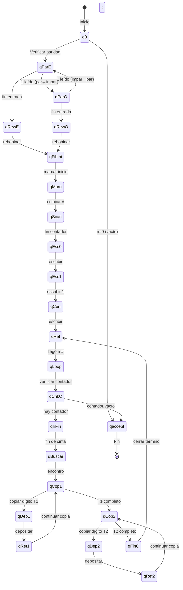

# Diagrama de la Máquina de Turing - Sucesión de Fibonacci

## Descripción General

Esta máquina de Turing **determinista de una sola cinta** calcula F(n), el n-ésimo 
número de Fibonacci. Utiliza el método iterativo manteniendo los términos de la 
secuencia en la cinta y un contador para las iteraciones restantes.

**Característica especial:** La máquina incluye una verificación de paridad inicial
usando estados alternantes (qParE/qParO) que simula el uso de memoria cache.

**Secuencia calculada:** 1, 1, 2, 3, 5, 8, 13... (omitiendo F(0)=0 por convención)

## Diagrama de Estados (Mermaid)



## Estructura de la Cinta

Durante la ejecución, la cinta mantiene el siguiente formato:

```
#[contador].[término1];[término2];...;[términoN];
```

### Ejemplo para n=5:

```
Inicial:  11111
Paso 1:   #x1111.                    (preparando)
Paso 2:   #x1111.;1;                 (F(1)=1 inicial)
Iteración 1: #xx111.;1;1;            (F(2)=1)
Iteración 2: #xxx11.;1;1;11;         (F(3)=2)  
Iteración 3: #xxxx1.;1;1;11;111;     (F(4)=3)
Iteración 4: #xxxxx.;1;1;11;111;11111; (F(5)=5)
Final:    Resultado = 11111 (5 en unario)
```

## Estados de la Máquina

| Estado | Descripción |
|--------|-------------|
| q0 | Estado inicial - verifica si hay entrada |
| qParE | Verificar paridad - conteo par |
| qParO | Verificar paridad - conteo impar |
| qRewE | Rebobinar al inicio (paridad par) |
| qRewO | Rebobinar al inicio (paridad impar) |
| qFibIni | Iniciar cálculo Fibonacci |
| qMuro | Colocar marcador de inicio (#) |
| qScan | Escanear hacia derecha |
| qEsc0 | Escribir zona de trabajo (.) |
| qEsc1 | Escribir primer término F(1)=1 |
| qCerr | Cerrar término con separador (;) |
| qRet | Retornar al inicio de cinta |
| qLoop | Inicio del ciclo principal |
| qChkC | Verificar contador |
| qIrFin | Ir al final de la cinta |
| qBuscar | Buscar último término |
| qCop1 | Copiar término 1 (F(i)) |
| qDep1 | Depositar dígito de término 1 |
| qRet1 | Retornar a fuente término 1 |
| qCop2 | Copiar término 2 (F(i-1)) |
| qDep2 | Depositar dígito de término 2 |
| qRet2 | Retornar a fuente término 2 |
| qFinC | Finalizar ciclo, agregar separador |
| qaccept | Estado de aceptación |

## Alfabeto de la Cinta

| Símbolo | Significado |
|---------|-------------|
| 1 | Dígito unario |
| _ | Blanco (espacio vacío) |
| # | Marcador de inicio de cinta |
| . | Separador zona de contador y trabajo |
| ; | Separador entre términos Fibonacci |
| x | Contador usado/procesado |
| y | Marcador temporal copiando término 1 |
| z | Marcador temporal copiando término 2 |

## Funcionamiento Paso a Paso

### Ejemplo: Calcular F(4)

**Entrada:** `1111` (4 en unario)

1. **Verificación de paridad (opcional):**
   - Lee cada 1, alternando entre qParE y qParO
   - Termina sabiendo si n es par o impar

2. **Preparación inicial:**
   - Marca el primer 1 como 'x' (contador)
   - Coloca '#' al inicio
   - Escanea hasta el final del contador
   - Escribe `.;1;` (zona trabajo + primer término)

3. **Ciclo principal (por cada 1 en el contador):**
   - Verificar si queda contador (qChkC)
   - Ir al final de la cinta (qIrFin)
   - Copiar F(i) dígito a dígito al final (qCop1/qDep1)
   - Copiar F(i-1) dígito a dígito al final (qCop2/qDep2)
   - Cerrar el nuevo término con ';' (qFinC)

4. **Resultado:**
   - Cuando el contador se agota, el último término es F(n)
   - F(4) = 3, representado como '111'

## Complejidad Temporal

Esta máquina tiene **complejidad exponencial** O(φ^n) donde φ ≈ 1.618 (razón áurea).

| n | F(n) | Pasos | Ratio |
|---|------|-------|-------|
| 5 | 5 | 331 | - |
| 6 | 8 | 585 | 1.77 |
| 7 | 13 | 1,105 | 1.89 |
| 8 | 21 | 2,255 | 2.04 |
| 9 | 34 | 4,971 | 2.20 |
| 10 | 55 | 11,641 | 2.34 |
| 11 | 89 | 28,449 | 2.44 |
| 12 | 144 | 71,443 | 2.51 |

El crecimiento exponencial se debe a:
- Múltiples recorridos de la cinta por iteración
- Copia dígito a dígito de los términos
- Los términos Fibonacci crecen exponencialmente

## Espacio

- **Espacio en cinta:** O(F(n) × n) - Todos los términos se mantienen en la cinta
- La cinta final contiene toda la secuencia: ;1;1;11;111;11111;...
